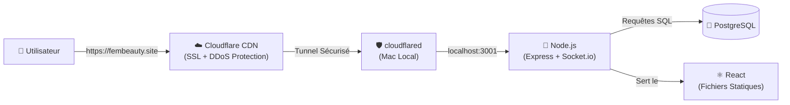

# Guide Complet : Lier un Projet Local à un Domaine via Cloudflare 🌐

Ce guide documente toutes les étapes pour rendre une application Node.js locale accessible sur un domaine personnalisé (ex: `fembeauty.site`) grâce à un tunnel Cloudflare sécurisé.

---

## Étape 1 : Acheter un Domaine

Achetez un nom de domaine chez un registrar de votre choix :
- 🔗 [Namecheap](https://www.namecheap.com)
- 🔗 [OVH](https://www.ovh.com)
- 🔗 [GoDaddy](https://www.godaddy.com)

> [!NOTE]
> Dans notre cas, le domaine `fembeauty.site` a été acheté sur **Namecheap**.

---

## Étape 2 : Créer un Compte Cloudflare (Gratuit)

1. Allez sur 🔗 **[dash.cloudflare.com](https://dash.cloudflare.com)** et créez un compte.
2. En haut à droite, cliquez sur **"+ Add"** → **"Connect a domain"**.
3. Tapez votre domaine (ex: `fembeauty.site`).
4. Choisissez le plan **Free** (gratuit).
5. Cloudflare vous donnera **2 serveurs DNS personnalisés**, par exemple :

| Serveur DNS Cloudflare |
|------------------------|
| `milan.ns.cloudflare.com` |
| `sonia.ns.cloudflare.com` |

> [!IMPORTANT]
> Notez bien ces 2 adresses, elles sont uniques à votre compte.

---

## Étape 3 : Pointer le Domaine vers Cloudflare (chez Namecheap)

1. Connectez-vous sur 🔗 **[namecheap.com](https://ap.www.namecheap.com/domains/domaincontrolpanel/fembeauty.site/domain)**
2. Allez dans **Dashboard** → cliquez sur **"Manage"** à côté de votre domaine.
3. Dans l'onglet **"Domain"**, trouvez la section **"Nameservers"**.
4. Changez le menu déroulant de **"Namecheap BasicDNS"** vers **"Custom DNS"**.
5. Entrez les 2 serveurs Cloudflare :
   - `milan.ns.cloudflare.com`
   - `sonia.ns.cloudflare.com`
6. Cliquez sur la **coche verte ✅** pour sauvegarder.

> [!WARNING]
> La propagation DNS prend entre **5 minutes et 48 heures**. Vous pouvez vérifier l'avancement en temps réel sur :
> 🔗 [dnschecker.org/#NS/fembeauty.site](https://dnschecker.org/#NS/fembeauty.site)

---

## Étape 4 : Supprimer les anciens enregistrements DNS sur Cloudflare

1. Sur 🔗 **[dash.cloudflare.com](https://dash.cloudflare.com)**, cliquez sur votre domaine.
2. Menu gauche → **DNS** → **Records**.
3. Supprimez **tous** les enregistrements existants (A, AAAA, CNAME) qui pointent sur le domaine racine (`fembeauty.site`), car ils entreront en conflit avec le tunnel.

---

## Étape 5 : Installer Cloudflared (une seule fois)

Si `cloudflared` n'est pas installé sur votre Mac :

```bash
brew install cloudflared
```

---

## Étape 6 : Authentifier Cloudflared avec votre Compte

```bash
cloudflared tunnel login
```

- Un navigateur s'ouvrira automatiquement.
- Sélectionnez votre domaine (`fembeauty.site`).
- Cliquez sur **"Authorize"**.
- Le certificat sera sauvegardé dans `~/.cloudflared/cert.pem`.

---

## Étape 7 : Créer un Tunnel Nommé Permanent

```bash
cloudflared tunnel create fembeauty
```

Résultat attendu :
```
Created tunnel fembeauty with id e3e7e688-9049-4389-853f-b65d26f6e272
```

> [!TIP]
> Notez l'**ID du tunnel** (ex: `e3e7e688-...`). Il sera utilisé dans le fichier de configuration.

---

## Étape 8 : Associer le Domaine au Tunnel (DNS Route)

```bash
# Domaine principal (sans www)
cloudflared tunnel route dns fembeauty fembeauty.site

# Sous-domaine www
cloudflared tunnel route dns fembeauty www.fembeauty.site
```

Résultat attendu :
```
Added CNAME fembeauty.site which will route to this tunnel
Added CNAME www.fembeauty.site which will route to this tunnel
```

---

## Étape 9 : Créer le Fichier de Configuration

Créez le fichier `~/.cloudflared/config.yml` :

```yaml
tunnel: e3e7e688-9049-4389-853f-b65d26f6e272
credentials-file: /Users/younessabach/.cloudflared/e3e7e688-9049-4389-853f-b65d26f6e272.json

ingress:
  - hostname: fembeauty.site
    service: http://localhost:3001
  - hostname: www.fembeauty.site
    service: http://localhost:3001
  - service: http_status:404
```

> [!IMPORTANT]
> - Remplacez l'ID du tunnel par le vôtre.
> - `http://localhost:3001` correspond au port de votre backend Node.js.
> - La dernière règle `http_status:404` est obligatoire (catch-all).

---

## Étape 10 : Lancer l'Application + le Tunnel

```bash
# 1. Lancer le backend Node.js
cd local-web-test/backend && node index.js

# 2. Lancer le tunnel permanent (dans un autre terminal)
cloudflared tunnel run fembeauty
```

Résultat attendu :
```
Registered tunnel connection connIndex=0 ... location=mad05 protocol=quic
Registered tunnel connection connIndex=1 ... location=mad01 protocol=quic
```

---

## Étape 11 : Accéder à la Documentation API (Swagger) et la Sécuriser 🔒

L'application intègre une documentation interactive des routes de l'API via **Swagger UI**. 

Par mesure de sécurité (puisque le tunnel expose le serveur local à l'internet public), l'accès à Swagger est protégé par une authentification **HTTP Basic**.

### 1. URL de la Documentation
- 🔗 **[https://www.fembeauty.site/api-docs](https://www.fembeauty.site/api-docs)** (ou via votre tunnel Cloudflare)

### 2. Identifiants de connexion requis
Lors de la visite de la page, le navigateur affichera une boîte de dialogue d'authentification. Utilisez les identifiants suivants :

| Identifiant | Valeur |
|-------------|--------|
| **Nom d'utilisateur** | `admin` |
| **Mot de passe** | `fembeauty2026` |

> [!TIP]
> Ces identifiants sont définis et personnalisables dans le fichier `.env` du backend :
> ```env
> SWAGGER_USER=admin
> SWAGGER_PASSWORD=fembeauty2026
> ```

---

## Résultat Final 🎉

Une fois les DNS propagés, votre application sera accessible sur :

| URL | Statut |
|-----|--------|
| 🔗 **https://fembeauty.site** | ✅ Domaine principal |
| 🔗 **https://www.fembeauty.site** | ✅ Avec www |
| 🔗 **https://www.fembeauty.site/api-docs** | 🔒 API Swagger (Sécurisée) |

Avec :
- ✅ Certificat SSL gratuit (HTTPS automatique)
- ✅ Protection DDoS par Cloudflare
- ✅ URL permanente (ne change plus jamais)
- ✅ Pas besoin de serveur cloud payant (le Mac fait office de serveur)

---

## Commandes Utiles

| Action | Commande |
|--------|----------|
| Vérifier les DNS | `dig fembeauty.site NS +short` |
| Lister les tunnels | `cloudflared tunnel list` |
| Supprimer un tunnel | `cloudflared tunnel delete fembeauty` |
| Voir les logs du tunnel | `cloudflared tunnel run fembeauty` |
| Vérifier la propagation DNS | 🔗 [dnschecker.org](https://dnschecker.org/#NS/fembeauty.site) |

---

## Comment trouver l'adresse de son Tunnel pour créer des sous-domaines ? 🔍

Si vous avez besoin de l'adresse de votre tunnel pour configurer manuellement des sous-domaines (comme un enregistrement `CNAME`) sur le tableau de bord Cloudflare :

1. Ouvrez le fichier de configuration local situé sur votre Mac dans :
   `~/.cloudflared/config.yml` (ou `/Users/younessabach/.cloudflared/config.yml`)
2. Repérez la valeur de la variable `tunnel` (ex : `e3e7e688-9049-4389-853f-b65d26f6e272`).
3. L'adresse de routage du tunnel à renseigner dans la case **Target** de Cloudflare est toujours :
   `[ID-DU-TUNNEL].cfargotunnel.com`
   *(Dans votre cas : `e3e7e688-9049-4389-853f-b65d26f6e272.cfargotunnel.com`)*

---

## Gestion des Serveurs en Arrière-Plan (Lancement & Arrêt) 🚀🛑

Pour vous éviter de taper de longues commandes dans votre terminal, deux scripts raccourcis ont été créés à la racine de votre projet :

### 1. Démarrer les serveurs (Chat + Tunnel)
Exécutez simplement cette commande dans le terminal du projet :
```bash
./start-servers.sh
```

### 2. Arrêter les serveurs (Chat + Tunnel)
Exécutez cette commande dans le terminal du projet :
```bash
./stop-servers.sh
```

*(Ces scripts gèrent automatiquement le chargement et le déchargement des services LaunchAgents de macOS de manière transparente).*

---

## Architecture Finale


